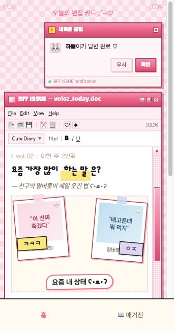
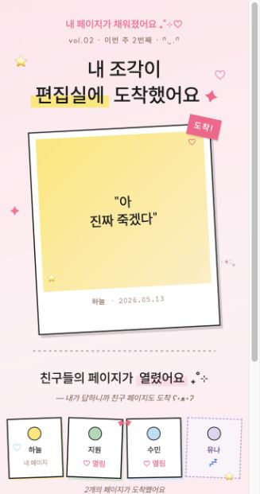
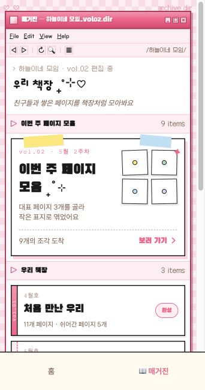
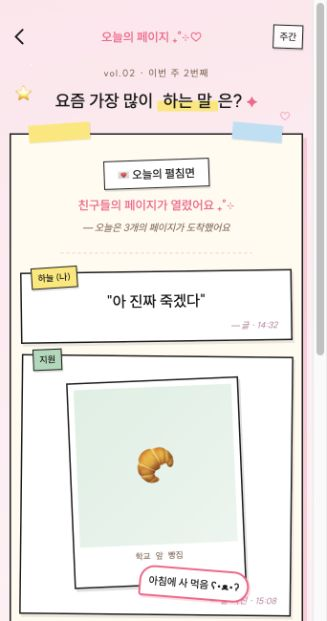
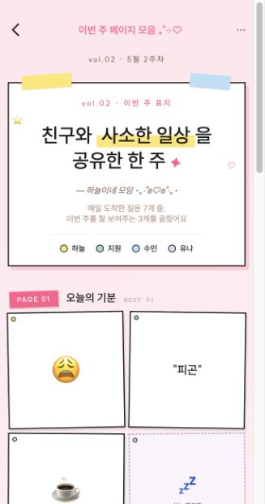
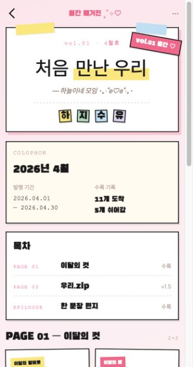

# BFF ISSUE

4명이 함께 매일 질문에 답하고, 그 답변이 주간 펼침면과 월간 매거진으로 쌓이는 모바일 웹 프로토타입입니다.  
핵심 메타포는 **편집실 + 책장**입니다. 매일의 답변은 “내 페이지”이자 “편집실에 도착한 조각”이고, 한 달이 지나면 “우리 책장”에 꽂히는 한 권의 우정 매거진이 됩니다.



## Core Idea

- **Daily**: 오늘의 편집 카드에 답변한다.
- **Exchange**: 내가 답하면 친구들의 페이지가 열린다.
- **Weekly**: 매일 제안된 질문 중 대표 3개가 주간 페이지로 편집된다.
- **Monthly**: 한 달치 페이지가 `vol.01` 같은 매거진 한 권으로 출간된다.
- **Share**: 초대 카드, 주간 표지, 월간 표지를 카톡 공유 카드처럼 미리 본다.

## Product Tone

- Korean mobile-first prototype, optimized around a 375px viewport.
- Y2K, Windows XP, MSN Messenger, pink desktop chrome.
- Cute but readable typography: Pretendard for base readability, Gaegu-style handwritten accents for emotional copy.
- Magazine objects: polaroids, stickers, masking tape, dotted dividers, bookshelf rows.

## Screens

| Route | Screen |
| --- | --- |
| `/` | Home, Prompt Card |
| `/onboarding` | 3-page onboarding |
| `/answer` | Answer type selection |
| `/write/text` | Text answer input |
| `/write/photo` | Photo/meme answer input |
| `/write/sticker` | Sticker answer input |
| `/complete` | Submission complete |
| `/friends/today` | Friend responses |
| `/weekly` | Weekly curated preview |
| `/magazine` | Magazine bookshelf tab |
| `/magazine/:vol` | Monthly magazine view |
| `/group/create` | Group create flow |
| `/invite/:code` | Invite accept flow |
| `/share/kakao` | Kakao share preview |
| `/font-preview` | Temporary font comparison screen |

More route notes live in [docs/ROUTES.md](./docs/ROUTES.md).

## Screenshot Gallery

| Home | Complete | Magazine |
| --- | --- | --- |
|  |  |  |

| Friend Responses | Weekly | Monthly |
| --- | --- | --- |
|  |  |  |

All current screen captures are stored in [`screenshots/`](./screenshots).

## Tech Stack

- React 19
- TypeScript
- Vite
- React Router
- Tailwind CSS
- ESLint

## Getting Started

```bash
npm install
npm run dev
```

Open:

```text
http://127.0.0.1:5173/
```

The home route uses `localStorage.onboarded`. If the app opens onboarding first, finish onboarding or run this in the browser console:

```js
localStorage.setItem('onboarded', 'true')
```

## Scripts

```bash
npm run dev      # local development server
npm run lint     # eslint
npm run build    # production build
npm run preview  # preview built app
```

## Project Structure

```text
src/
  components/        reusable UI pieces
  components/ui/     small visual primitives
  components/win/    Windows/MSN-style UI chrome
  data/              mock data and sticker data
  pages/             layout-bound pages
  screens/           route-level screens
  copy.ts            shared product copy
screenshots/         current visual captures for review/README
docs/                project notes for GitHub handoff
```

## Current Scope

This is a front-end prototype. Data is mocked in the client, and social/share actions are currently placeholders or preview flows. The prototype is intended to validate the core loop, tone, copy, and visual system before backend integration.

## Documentation

- [Project Brief](./docs/PROJECT_BRIEF.md)
- [Routes](./docs/ROUTES.md)
- [GitHub Checklist](./docs/GITHUB_CHECKLIST.md)
- [Design System Notes](./DESIGN.md)
